<!-- ═══════════════════════════════════════════════════════════════════ -->
<!--  HEADER  -->
<!-- ═══════════════════════════════════════════════════════════════════ -->

 

  
  
  
  

 

<!-- ═══════════════════════════════════════════════════════════════════ -->
<!--  PROFILE OVERVIEW  -->
<!-- ═══════════════════════════════════════════════════════════════════ -->

<table>
<tr>
<td width="28%" align="center" valign="top">
 

  
<b>Hamza Bendaoud</b> 
📍 Paris, France 
🎓 CentraleSupélec × ESSEC 
💼 CEO @ MednumTrust
</td>
<td width="72%" valign="top">

## 👋 Welcome

I'm an **AI Engineer & Data Scientist** with hands-on experience deploying production-grade machine learning systems across **healthcare, aerospace, banking, and railway industries**.

My work sits at the intersection of **rigorous engineering** (CentraleSupélec) and **strategic business thinking** (ESSEC). I don't just build models — I build solutions that solve real problems, ship to production, and create measurable impact.

**🎯 What recruiters should know about me:**
- ✅ End-to-end ownership: from research → prototype → production deployment
- ✅ Strong LLM/RAG expertise (LangChain, GPT-4, HuggingFace, fine-tuning)
- ✅ Entrepreneur — co-founded and leading a MedTech AI startup as CEO
- ✅ Trilingual (FR · EN · AR), comfortable in international teams
- ✅ Track record of delivering in high-stakes environments (Safran, Attijariwafa Bank, ONCF)

📌 **Currently looking for:** Data Scientist / AI Engineer roles in Paris or remote-friendly companies.

</td>
</tr>
</table>

 

---

<!-- ═══════════════════════════════════════════════════════════════════ -->
<!--  FEATURED PROJECT — MEDNUMTRUST  -->
<!-- ═══════════════════════════════════════════════════════════════════ -->

# 🏥 Featured Project — MednumTrust

### *A New Eye on the Future of Traditional Care*

 

  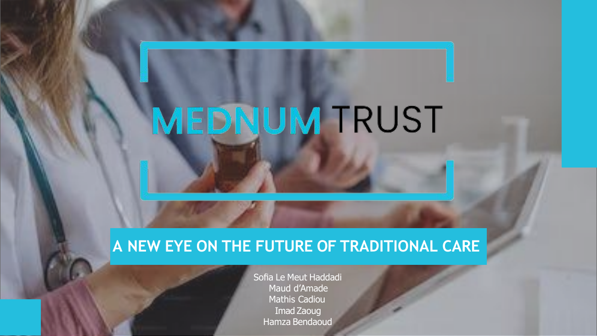

 

> A MedTech startup I co-founded and lead as CEO, building **AI-powered medical record management** for healthcare professionals. We tackle a real problem in healthcare with a production-ready solution combining **OCR, LLMs, and secure data sharing**.

 

### 👥 The Team — A Multidisciplinary Engineering & Business Crew

  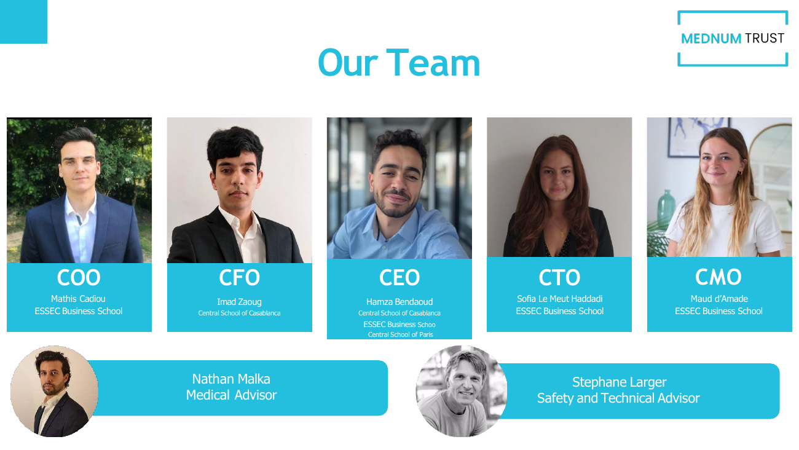

 

### 🎯 The Problem We're Solving

  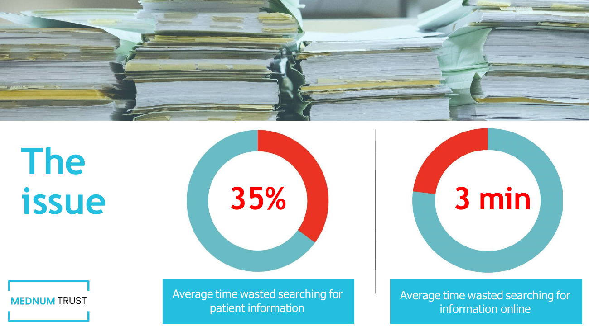

Doctors spend **35% of their time** searching for patient information and waste **3 minutes per online query** — time that should be spent with patients.

 

### 💡 Our Value Proposition

  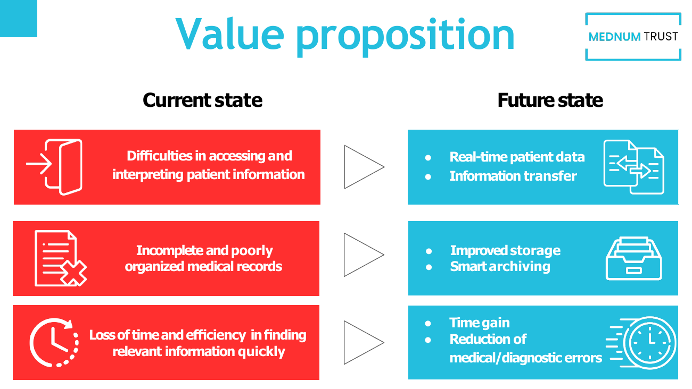

 

### 🔄 How It Works — 3 Pillars

  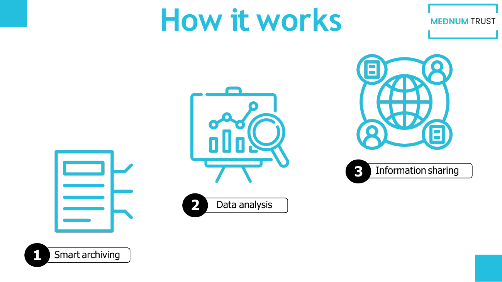

 

### 🩺 The Doctor's Perspective — Application Walkthrough

  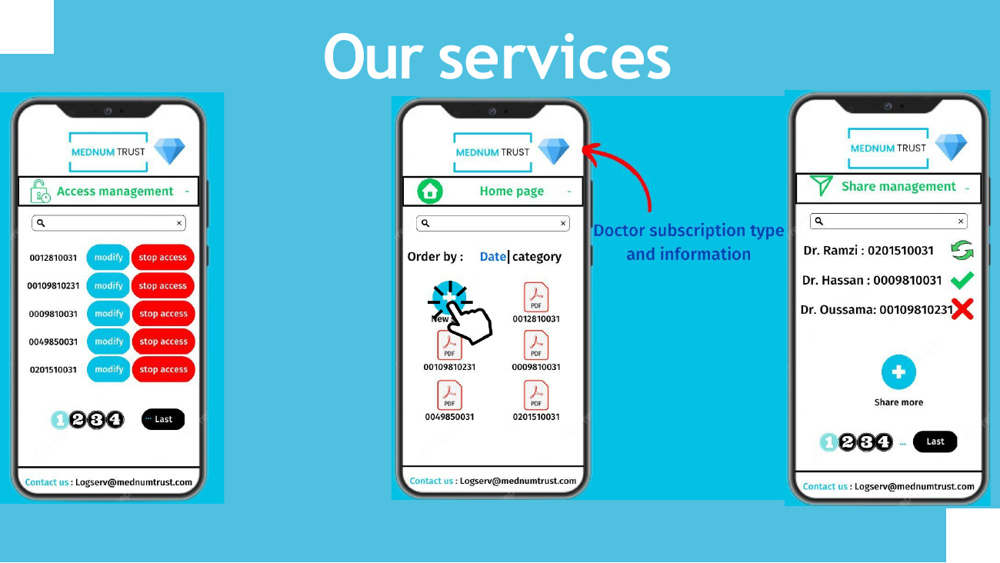

 

### ✨ Underlying Magic — End-to-End User Flow

  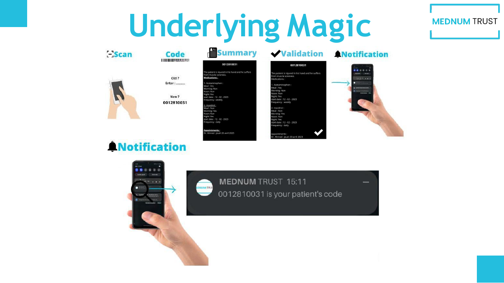

 

### ⚙️ Technical Pipeline — Where I Lead the AI Engineering

  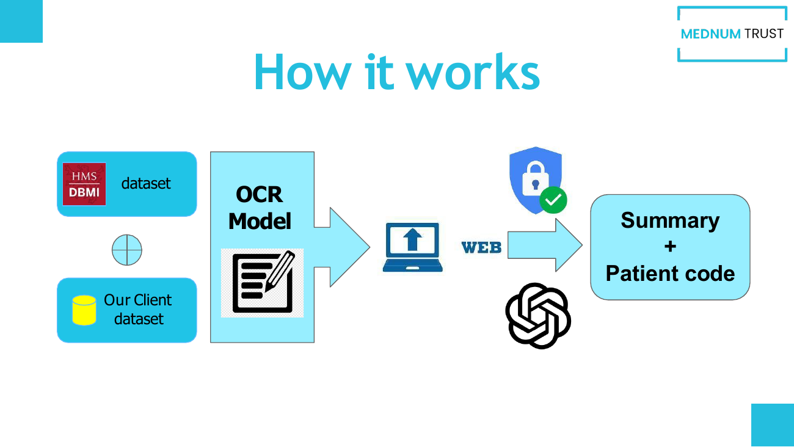

**Stack:** HMS DBMI medical datasets · custom OCR model · secure web infrastructure · GPT-4 for structured summary generation · unique patient codes for traceability.

 

### 👤 The Patient's Perspective

  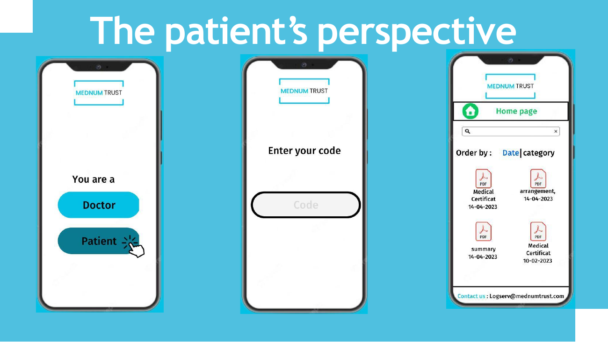

 

### 🎯 Competitive Positioning

  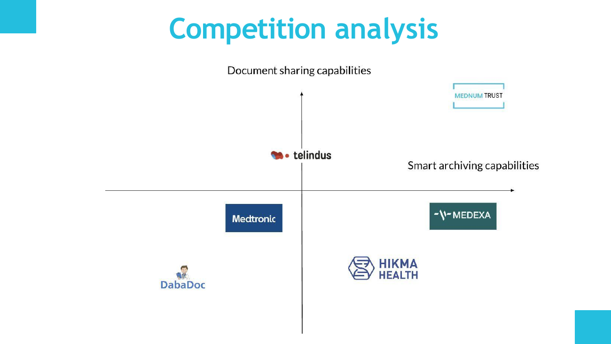

We occupy a distinctive position combining strong **smart archiving** with industry-leading **document sharing capabilities**.

 

### 📊 Market Sizing

  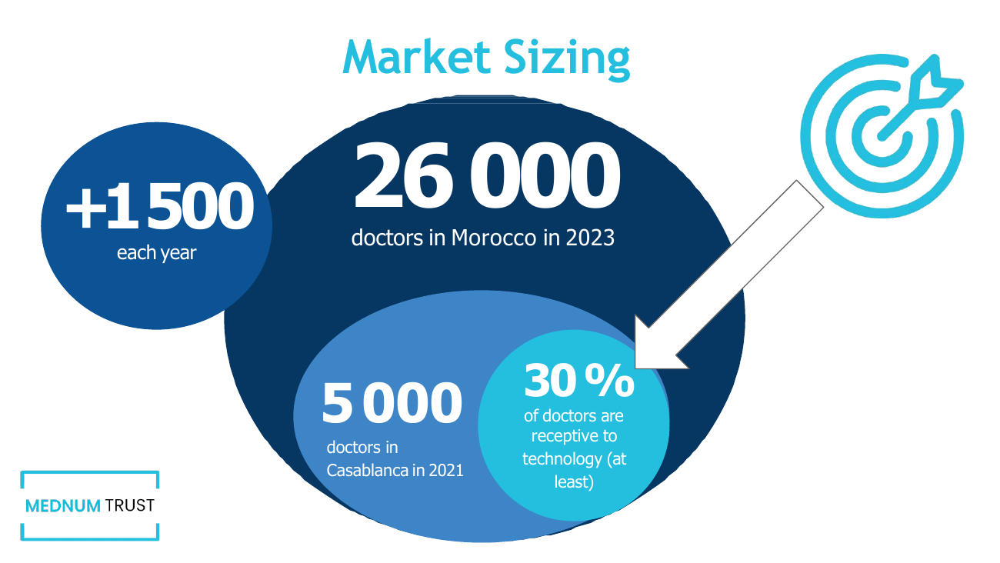

 

### 🎉 First Clients & Validation

  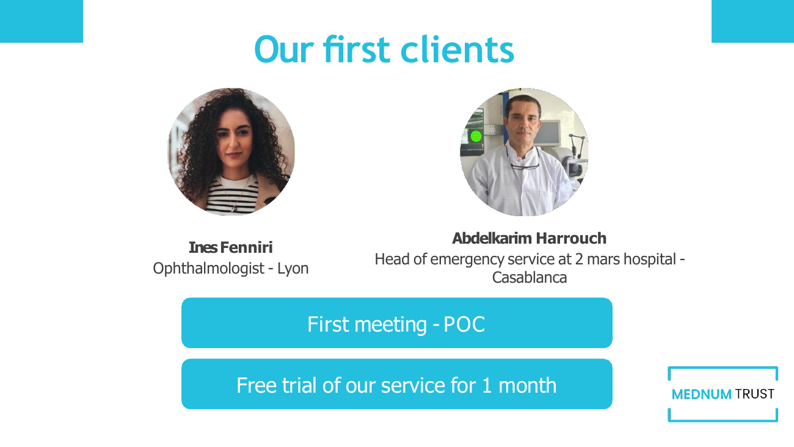

 

### 💼 Business Model

  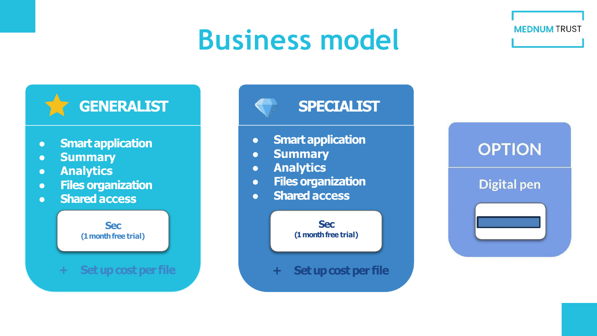

 

### 🚀 Roadmap

  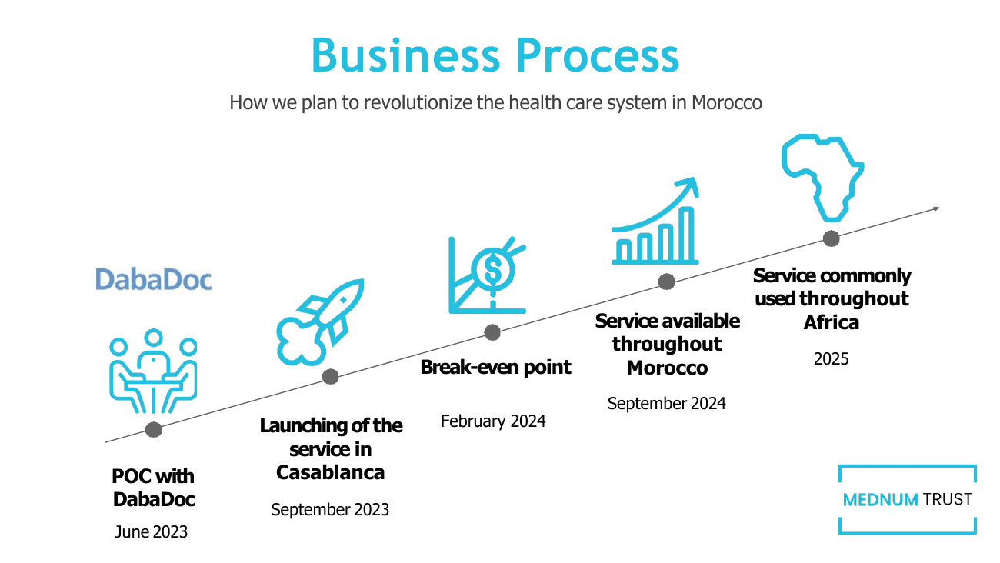

 

---

<!-- ═══════════════════════════════════════════════════════════════════ -->
<!--  TECH STACK  -->
<!-- ═══════════════════════════════════════════════════════════════════ -->

## 🛠️ Tech Stack

### 🤖 AI / Machine Learning

### 🔗 LLM & Generative AI

### 📊 Data & Analytics

### ☁️ Cloud & DevOps

### 🌐 Web & Backend

---

<!-- ═══════════════════════════════════════════════════════════════════ -->
<!--  EXPERIENCE  -->
<!-- ═══════════════════════════════════════════════════════════════════ -->

## 💼 Professional Experience

<table>
<tr>
<td width="20%" valign="top"><b>🏥 MednumTrust</b> Jan 2025 – Present</td>
<td valign="top"><b>CEO & Co-founder</b> Leading product vision and engineering team for an LLM-powered medical records platform. Built end-to-end OCR + GPT-4 pipeline for natural language querying of patient data.</td>
</tr>
<tr>
<td valign="top"><b>✈️ Safran Aircraft Engines</b> Jun 2024 – Dec 2024</td>
<td valign="top"><b>Data Scientist (Internship)</b> Designed scalable analytics pipelines covering ingestion, transformation, validation. Developed decision-support models and Power BI dashboards for engineering trade-off analysis.</td>
</tr>
<tr>
<td valign="top"><b>🚂 ONCF (Railway)</b> Mar 2023 – Aug 2023</td>
<td valign="top"><b>AI Engineer (Internship)</b> Built anomaly detection systems on train sensor data using Isolation Forest, Autoencoders, XGBoost. Applied time-series feature engineering for predictive modeling.</td>
</tr>
<tr>
<td valign="top"><b>🏦 Attijariwafa Bank</b> Oct 2022 – Feb 2023</td>
<td valign="top"><b>Assistant Engineer</b> Implemented a RAG pipeline (chunking, hybrid retrieval, context-grounded generation) using GPT-4 to automate strategic deliverables on financial databases.</td>
</tr>
<tr>
<td valign="top"><b>✈️ Royal Air Maroc</b> Jun 2022 – Aug 2022</td>
<td valign="top"><b>Software Engineer (Internship)</b> Engineered a workforce management system with backend services, REST APIs, and structured databases.</td>
</tr>
</table>

---

<!-- ═══════════════════════════════════════════════════════════════════ -->
<!--  EDUCATION  -->
<!-- ═══════════════════════════════════════════════════════════════════ -->

## 🎓 Education

| School | Program | Year |
|:---|:---|:---:|
| 🏛️ **CentraleSupélec** | Exchange Year — Data Science & System Design | 2023–2024 |
| 🏛️ **ESSEC Business School** | Strategic Management & Data-Driven Decision Making | 2022–2023 |
| 🏛️ **École Centrale Casablanca** | Engineering — Data Science & Digitalization | 2021–2025 |

---

<!-- ═══════════════════════════════════════════════════════════════════ -->
<!--  STATS  -->
<!-- ═══════════════════════════════════════════════════════════════════ -->

## 📊 GitHub Stats

  
  

  

---

<!-- ═══════════════════════════════════════════════════════════════════ -->
<!--  ACHIEVEMENTS  -->
<!-- ═══════════════════════════════════════════════════════════════════ -->

## 🏆 Achievements & Distinctions

| 🏅 | Distinction |
|:---:|:---|
| 🥇 | **IMO** — Regional representative, Moroccan Mathematical Olympiad |
| 📜 | **Google** — Project Management & Agile Methodology Certification |
| 🎯 | **Roland Berger** — Data Consulting strategic framework |
| 🔬 | **Research Paper** — AI/ML applied to quantum physics (Schrödinger equation) |

---

<!-- ═══════════════════════════════════════════════════════════════════ -->
<!--  CTA  -->
<!-- ═══════════════════════════════════════════════════════════════════ -->

## 📬 Let's Connect

I'm always open to discussing **AI roles, collaborations, or just exchanging ideas** about LLMs, healthcare AI, or entrepreneurship.

  

<i>"Building AI that actually matters — one pipeline at a time 🚀"</i>

